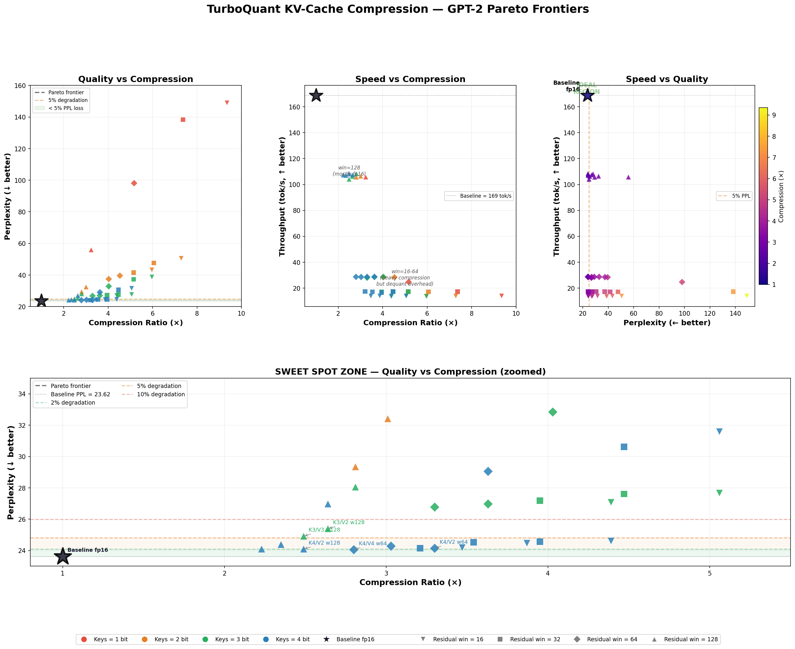
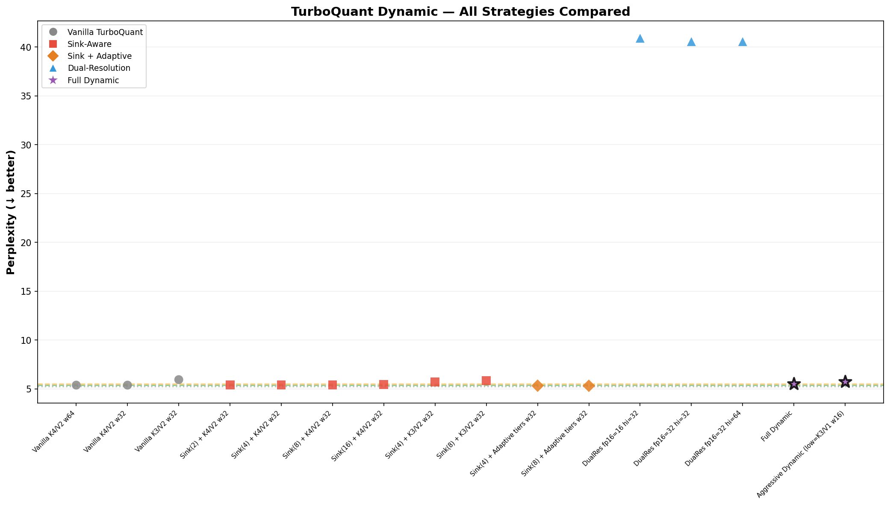
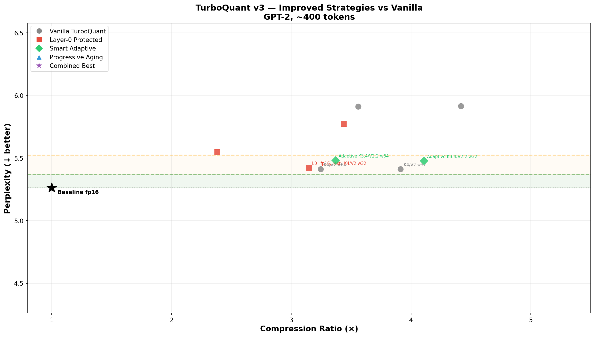

# TurboQuant-Adaptive

**Sink-aware, sensitivity-tiered KV-cache quantization built on Google's TurboQuant.**

We implement [TurboQuant](https://arxiv.org/abs/2504.19874) (ICLR 2026) from scratch in PyTorch, then systematically test 40+ improvement strategies. By combining attention-sink protection with per-layer sensitivity-tiered bit allocation, we cut quality degradation from **+2.4% to +1.1% perplexity** on GPT-2 at comparable compression.

> The individual techniques (sink protection, adaptive bits) are established in the literature. Our contribution is the systematic ablation study showing what composes well with TurboQuant — and more importantly, what doesn't.

---

## Table of Contents

- [Background: What is TurboQuant?](#background-what-is-turboquant)
- [Key Findings](#key-findings)
- [Results](#results)
- [The Graveyard: What Didn't Work](#the-graveyard-what-didnt-work)
- [System & Benchmarks](#system--benchmarks)
- [Usage](#usage)
- [Repository Structure](#repository-structure)
- [Limitations](#limitations)
- [Future Directions](#future-directions)
- [Prior Work & Credit](#prior-work--credit)
- [License](#license)

---

## Background: What is TurboQuant?

TurboQuant (Google, ICLR 2026) compresses the key-value cache during LLM inference:

1. **Normalize** — save the L2 norm of each KV vector
2. **Rotate** — multiply by a random orthogonal matrix (Haar-distributed from QR of Gaussian)
3. **Quantize** — each rotated coordinate now follows a known Beta distribution; apply an optimal Lloyd-Max scalar quantizer per coordinate
4. **Reconstruct** — lookup centroids, inverse-rotate, rescale by norm

The rotation is the key insight: it makes coordinates nearly independent with a known distribution, so a single precomputed scalar codebook works optimally for every coordinate. Training-free, data-free, works on any model.

**Reconstruction quality** (Lloyd-Max codebook with exact Beta PDF, d=64):

| Bits | MSE | Cosine Similarity | Compression vs fp16 |
|------|-----|-------------------|---------------------|
| 1-bit | 0.090 | 0.801 | 16x |
| 2-bit | 0.029 | 0.942 | 8x |
| 3-bit | 0.008 | 0.984 | 5.3x |
| 4-bit | 0.002 | 0.996 | 4x |

---

## Key Findings

### 1. Attention Sinks Are Load-Bearing

By analyzing GPT-2's attention maps with `output_attentions=True`, we found that **token 0 absorbs 35-66% of all attention mass** in layers 3-11:

```
Layer  0: token 0 gets  2.8% attention (uniform-ish)
Layer  3: token 0 gets 35.8%
Layer  5: token 0 gets 59.2%  <-- more than half of ALL attention
Layer  7: token 0 gets 65.9%
Layer  9: token 0 gets 62.9%
Layer 11: token 0 gets 48.1%
```

This is the [attention sink phenomenon](https://arxiv.org/abs/2309.17453) (Xiao et al., 2023). The model uses early tokens as "attention parking lots" for unused probability mass. Quantizing these tokens — even at 4-bit precision — introduces error that propagates through every attention computation downstream.

**Universal sinks** (top-4 attention targets in 50%+ of layers): **positions 0, 4, and 27** (BOS and structural punctuation).

Keeping 8 sink tokens in fp16 costs ~0.3% of total cache memory but removes the single largest source of quantization error.

### 2. Layer 0 Is 5-25x More Sensitive

We measured per-layer sensitivity by injecting calibrated noise into each layer's attention output and measuring the change in final logits:

```
Layer  0: 1.0000 ████████████████████████████████████████  <-- 5-25x more sensitive
Layer  1: 0.1907 ███████
Layer  2: 0.1828 ███████
Layer  4: 0.2026 ████████
Layer  5: 0.2006 ████████
Layer  3: 0.0406 █
Layer  6: 0.0315 █
Layer  7: 0.0347 █
Layer  8: 0.0613 ██
Layer  9: 0.0471 █
Layer 10: 0.0256 █
Layer 11: 0.0073 ▏
```

Layer 0 processes the rawest token representations before any contextual mixing has occurred. Errors here compound through all 11 subsequent layers.

### 3. The 2-Bit Cliff

Going below 3-bit keys causes a **discontinuous quality collapse**:

| Key Bits | Cosine Sim | PPL Impact |
|----------|-----------|------------|
| K4 | 0.996 | +2-3% |
| K3 | 0.984 | +5-15% |
| **K2** | **0.942** | **+24-75%** |
| K1 | 0.801 | +130-530% |

The jump from K3 to K2 is catastrophic because `softmax` exponentially amplifies small attention score errors. At 0.942 cosine similarity, the attention score errors are large enough to flip the relative ordering of keys, producing garbage attention distributions.

**Rule: never go below K3 for keys, regardless of how "unimportant" a layer appears.**

### 4. The Winning Recipe

| Layer | Config | Rationale |
|-------|--------|-----------|
| Layer 0 | K4/V4 | 5-25x more sensitive to noise |
| Layers 1, 2, 4, 5 | K4/V2 | Medium sensitivity |
| Layers 3, 6-11 | K3/V2 | Low sensitivity (K3 floor) |
| All layers | First 8 tokens in fp16 | Attention sinks |
| All layers | Last 32 tokens in fp16 | Residual window |

Avg bits: K3.4/V2.2 (fewer bits than uniform K4/V2, but better quality).

---

## Results

### Quality Comparison

| Strategy | PPL | Delta | Compression |
|----------|-----|-------|-------------|
| Baseline fp16 | 5.26 | -- | 1.00x |
| **Sink(8) + Adaptive tiers (ours)** | **5.32** | **+1.1%** | **3.27x** |
| Sink(4) + Adaptive tiers (ours) | 5.33 | +1.3% | 3.27x |
| Vanilla TurboQuant K4/V2 w64 | 5.39 | +2.4% | 2.60x |
| Vanilla TurboQuant K4/V2 w32 | 5.39 | +2.4% | 3.41x |
| Vanilla TurboQuant K3/V2 w32 | 5.91 | +12.4% | 4.42x |

### Pareto Frontier (40-config sweep)



Bottom panel zooms into the sweet-spot region. Green shading = <2% PPL loss; orange = <5%.

### Strategy Comparison



---

## The Graveyard: What Didn't Work

We tested 7 "obvious" improvement ideas. Almost all made things worse. This is arguably the most useful part of this project.

| Idea | Result | Root Cause |
|------|--------|------------|
| **Hadamard rotation** | +7.1% PPL (worse) | Same reconstruction MSE as random orthogonal, but the Hadamard structure interacts poorly with learned weight matrices. Random rotation breaks correlations more effectively. |
| **Residual quantization** | +11-31% MSE (worse) | Splitting 3-4 total bits into coarse (b-1) + residual (1) is strictly worse than b bits in one stage. The 1-bit residual is so coarse it adds noise instead of correcting. |
| **Channel-grouped codebooks** | -0.3% MSE (negligible) | The rotation already equalizes per-coordinate variance. There's almost nothing for grouping to exploit. |
| **Importance by key norm** | +117% PPL (catastrophic) | Reordering tokens by importance breaks positional encoding. The model expects KV in positional order. |
| **Dual-resolution storage** | +671% PPL (catastrophic) | The K2/V1 low-resolution fallback is so bad that using it for even a few tokens poisons attention. The 2-bit cliff strikes again. |
| **Progressive aging** | +497% PPL (catastrophic) | Re-quantizing (decompress from K4 then re-compress to K3) compounds noise multiplicatively. Each round adds error on top of error. |
| **Naive adaptive (K2 floor)** | +27.6% PPL (worse) | Gave low-sensitivity layers K2 bits, which hits the 2-bit cliff. The sensitivity analysis found the right priority order, but K2 is never acceptable. |



### The Takeaway

The bottleneck in KV cache quantization is **not the quantizer math**. TurboQuant's rotation + Lloyd-Max is already near the information-theoretic limit. The gains come entirely from policy:

- Don't quantize what the model depends on (sinks)
- Don't waste bits where the model doesn't care (low-sensitivity layers)
- Never cross the 2-bit cliff (K3 minimum everywhere)

---

## System & Benchmarks

### Hardware

| Component | Spec |
|-----------|------|
| GPU | NVIDIA GeForce RTX 3090 (24 GB VRAM) |
| CPU | 24 cores |
| RAM | 47 GB |
| OS | Linux 6.8.0-106-generic |

### Software

| Package | Version |
|---------|---------|
| Python | 3.13.5 |
| PyTorch | 2.9.1+cu128 |
| CUDA | 12.8 |
| Transformers | 5.3.0 |
| SciPy | 1.17.1 |

### Model

| | |
|---|---|
| Model | GPT-2 (124M parameters) |
| Precision | fp16 |
| Model memory | 248 MB GPU |
| head_dim | 64 |
| num_heads | 12 |
| num_layers | 12 |

### Memory Usage (282 token sequence)

| Config | Sink fp16 | Recent fp16 | Compressed | Total | Compression |
|--------|-----------|-------------|------------|-------|-------------|
| Baseline fp16 | -- | 10,152 KB | -- | 10,152 KB | 1.00x |
| K4/V2 w64 | -- | 2,304 KB | 1,594 KB | 3,898 KB | 2.60x |
| K4/V2 w32 | -- | 1,152 KB | 1,828 KB | 2,980 KB | 3.41x |
| Sink(8)+Adaptive w32 | 288 KB | 1,152 KB | 1,661 KB | 3,101 KB | 3.27x |

KV cache at fp16 = `seq_len x head_dim x 2 bytes x 2 (K+V) x 12 heads x 12 layers`.

### Throughput

| Config | tok/s | Time (200 tokens) | Notes |
|--------|-------|-------------------|-------|
| Baseline fp16 | 163 | 1.23s | No overhead |
| TurboQuant K4/V2 w64 | 17 | 11.61s | Dequant overhead |
| TurboQuant K4/V2 w32 | 12 | 16.69s | More dequant work |
| Sink(8)+Adaptive w32 | 13 | 15.47s | Similar to vanilla |

**Important**: the throughput regression is an artifact of our naive Python dequantization (decompress entire cache to fp16 every forward pass). Production implementations use fused CUDA/Triton kernels that rotate the query forward and dot against quantized centroids directly, eliminating this overhead. The purpose of this project is to study quality/compression tradeoffs, not optimize throughput.

### Codebook Computation

| | |
|---|---|
| One-time cost | 30.1s (96 codebooks: 4 bit-widths x 12 layers x 2 K/V) |
| Per codebook | ~0.31s (Lloyd-Max iteration with exact Beta PDF, d=64) |
| Codebook storage | ~96 KB per bit-width per 12 layers (dominated by 64x64 rotation matrix = 8 KB) |

Codebooks are precomputed once and reused for all tokens. They depend only on `(head_dim, bits)`, not on data.

---

## Usage

### Quick Start

```bash
git clone https://github.com/gatordevin/turboquant-adaptive.git
cd turboquant-adaptive
pip install torch transformers scipy numpy matplotlib psutil

# Core demo: reconstruction quality + perplexity + generation
python turboquant_gpt2.py

# Full experiment suite (run from repo root)
python -m experiments.exp03_sink_aware_dynamic

# System benchmark with memory/timing
python -m experiments.exp06_system_benchmark
```

### Using the Quantizer

```python
from turboquant_gpt2 import TurboQuantizer

# Create a 4-bit quantizer for head_dim=64
quantizer = TurboQuantizer(head_dim=64, bits=4, device='cuda')

# Quantize: stores indices (long) + norms (fp16)
indices, norms = quantizer.quantize(key_vectors)  # (..., 64) -> indices (..., 64), norms (...)

# Dequantize: reconstructs fp16 vectors
key_hat = quantizer.dequantize(indices, norms)  # -> (..., 64)
```

### Using the Adaptive Cache with HuggingFace

```python
from experiments.exp03_sink_aware_dynamic import make_sink_cache

# Sensitivity tiers (measured empirically on GPT-2)
tiers = {
    0: (4, 4),                                     # Layer 0: K4/V4 (critical)
    **{i: (4, 2) for i in [1, 2, 4, 5]},           # High sensitivity: K4/V2
    **{i: (3, 2) for i in [3, 6, 7, 8, 9, 10, 11]}, # Low sensitivity: K3/V2
}

cache = make_sink_cache(
    head_dim=64, num_layers=12,
    key_bits=4, value_bits=2,
    num_sinks=8,            # protect first 8 tokens in fp16
    residual_window=32,     # keep last 32 tokens in fp16
    device='cuda',
    sensitivity_tiers=tiers,
)

# Drop in to any HuggingFace model
outputs = model(input_ids, past_key_values=cache)
```

---

## Repository Structure

```
turboquant-adaptive/
  turboquant_gpt2.py                        # Core library: TurboQuantizer, Lloyd-Max, cache layers
  requirements.txt
  LICENSE
  experiments/
    exp01_rotation_and_residual.py           # Hadamard, residual quant, channel grouping, importance
    exp02_layer_protection_and_aging.py      # Layer-0 fp16, smart adaptive, progressive aging
    exp03_sink_aware_dynamic.py              # Attention sinks, dual-resolution, entropy monitoring
    exp04_pareto_sweep.py                    # 40-config Pareto frontier with throughput
    exp05_plot_pareto.py                     # Visualization from precomputed data
    exp06_system_benchmark.py                # GPU memory, timing, cache size breakdown
  results/
    turboquant_pareto.png                    # Pareto frontier plots (3 panels + zoomed sweet spot)
    turboquant_v3_results.png                # Strategy comparison plot
    turboquant_dynamic_results.png           # Dynamic experiment results
```

The experiments are numbered in the order we ran them. Each is self-contained and runnable. They collectively tell the story: experiments 01-02 are the graveyard (what failed), experiment 03 is the breakthrough, 04-06 are analysis.

---

## Limitations

This project has important limitations that should be understood before drawing conclusions:

### Model Scale

All experiments use **GPT-2 (124M params, 12 layers, head_dim=64)**. This is a tiny model by modern standards. Key caveats:

- **head_dim=64 is at the lower bound** for TurboQuant's Gaussian approximation. The Beta distribution at d=64 is only approximately Gaussian. Larger models (head_dim=128+) will likely see better absolute quantization quality.
- **The sensitivity profile is GPT-2-specific.** Layer 0 being 5-25x more sensitive may not hold for other architectures. LLaMA, Mistral, and other models will have different sensitivity distributions and may have different sink patterns.
- **GPT-2 uses absolute positional embeddings**, not RoPE. Models with RoPE may benefit from pre-RoPE quantization (quantize before applying rotary embeddings), which we did not test.

### Sequence Length

Our eval text is **282-486 tokens**. At this length:
- The residual window (32-64 fp16 tokens) covers 7-23% of the sequence, which is generous. At 8K-128K context, the window covers <1% and compression benefits are much larger.
- Memory savings are modest in absolute terms (~7 MB savings). The real value of KV cache compression emerges at long contexts on large models where the cache exceeds GPU memory.

### Throughput

Our implementation is **10-12x slower than baseline** due to naive Python dequantization. This is not representative of production TurboQuant performance:
- Production implementations use fused Triton/CUDA kernels
- The standard trick is to rotate the query forward (`q_rot = q @ Pi.T`) and dot directly against quantized centroids, never materializing the full dequantized cache
- With proper kernels, TurboQuant overhead is typically <5% of baseline latency

### Evaluation

- We measure **perplexity only**, not downstream task accuracy (e.g., MMLU, HumanEval). Perplexity is a good proxy but doesn't capture all quality dimensions.
- We do not evaluate on long-context benchmarks like RULER or LongBench where KV cache compression matters most.
- Generation samples look qualitatively similar but we do not do systematic generation quality evaluation.

### Codebook Computation

Lloyd-Max codebook computation takes **~30s** for all codebooks. This is a one-time cost that could be eliminated by shipping precomputed codebooks (they depend only on `head_dim` and `bits`, not on data).

---

## Future Directions

Promising directions we identified but did not implement:

### High Priority (likely to work)

1. **Scale to larger models (LLaMA-7B, Mistral-7B).** The sensitivity profile, sink positions, and optimal bit allocation will differ. The framework (measure sensitivity -> allocate adaptively -> protect sinks) should transfer, but the specific recipe needs re-derivation per model.

2. **Pre-RoPE quantization.** For models using rotary embeddings, quantizing keys before applying RoPE gives a smoother distribution that quantizes better. Store the position index alongside compressed keys and apply RoPE at attention time. [KVQuant (NeurIPS 2024)](https://arxiv.org/abs/2401.18079) showed this helps significantly.

3. **Fused CUDA/Triton kernels.** Rotate the query forward and compute `score = sum_j q_rot[j] * centroid[idx[j]]` directly. This eliminates the dequantization bottleneck entirely and makes the throughput competitive with baseline.

4. **Long-context evaluation (8K-128K tokens).** At these lengths, the residual window is a tiny fraction of the sequence, compression ratios approach their theoretical maximum, and quality differences become more meaningful.

### Medium Priority (promising but uncertain)

5. **PALU-style low-rank projection + TurboQuant.** [PALU (ICLR 2025)](https://arxiv.org/abs/2407.21118) decomposes KV projection matrices into low-rank factors, projecting to d/2 before caching. This is orthogonal to quantization — project to half dimension, then TurboQuant the smaller vectors. Could double effective compression.

6. **Dynamic sink detection.** Instead of protecting fixed positions 0-7, track cumulative attention received per token and dynamically promote/demote tokens between fp16 and quantized storage. [KVSink (COLM 2025)](https://arxiv.org/abs/2508.04257) does this.

7. **Automatic sensitivity profiling.** Run a quick calibration pass (~100 tokens) on the target model to measure per-layer sensitivity, then auto-derive the bit allocation. Would make the recipe model-agnostic.

### Lower Priority (interesting but harder)

8. **Entropy-guided dynamic reallocation.** Monitor attention entropy per layer during generation. When a layer's entropy spikes (it's doing important discriminative work), temporarily promote its cache to higher precision. We built the monitoring infrastructure (`EntropyMonitoredLayer`) but didn't achieve gains — the overhead of switching precisions outweighed benefits at short sequences.

9. **CommVQ-style vector codebooks.** [CommVQ (ICML 2025)](https://arxiv.org/abs/2506.18879) uses additive vector quantization with codebooks that commute with RoPE, enabling 1-bit KV cache. Would replace Lloyd-Max entirely — more complex but potentially much higher compression.

10. **Cross-layer KV prediction.** Adjacent layers often produce similar KV vectors. A lightweight regressor could predict layer L's KV from layer L-1's, then only quantize the residual. [AQUA-KV (2025)](https://arxiv.org/abs/2501.01007) explores this.

---

## Prior Work & Credit

The individual techniques we combine are established in the literature:

| Paper | Venue | Contribution |
|-------|-------|-------------|
| [TurboQuant](https://arxiv.org/abs/2504.19874) (Zandieh et al.) | ICLR 2026 | Base algorithm: rotation + Lloyd-Max quantization |
| [StreamingLLM](https://arxiv.org/abs/2309.17453) (Xiao et al.) | ICLR 2024 | Discovered the attention sink phenomenon |
| [KVQuant](https://arxiv.org/abs/2401.18079) (Hooper et al.) | NeurIPS 2024 | First to protect sink tokens from quantization |
| [KVTuner](https://arxiv.org/abs/2502.04420) | ICML 2025 | Per-layer sensitivity-aware mixed-precision KV cache |
| [RotateKV](https://arxiv.org/abs/2501.16383) | IJCAI 2025 | Combines rotation with sink-aware quantization |
| [KIVI](https://arxiv.org/abs/2402.02750) | ICML 2024 | Asymmetric key/value quantization |
| [KVSink](https://arxiv.org/abs/2508.04257) | COLM 2025 | Dynamic sink detection and preservation |

**Our contribution is not the individual techniques, but the systematic empirical study** of what works and what doesn't when building on TurboQuant, including a concrete recipe and a detailed record of failed experiments. We believe the negative results (what doesn't work and why) are as valuable as the positive ones.

---

## License

MIT
