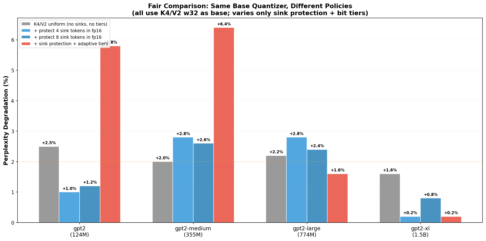
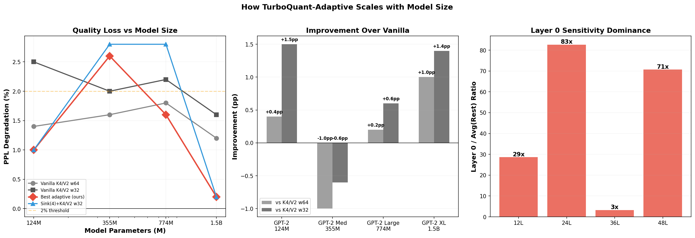
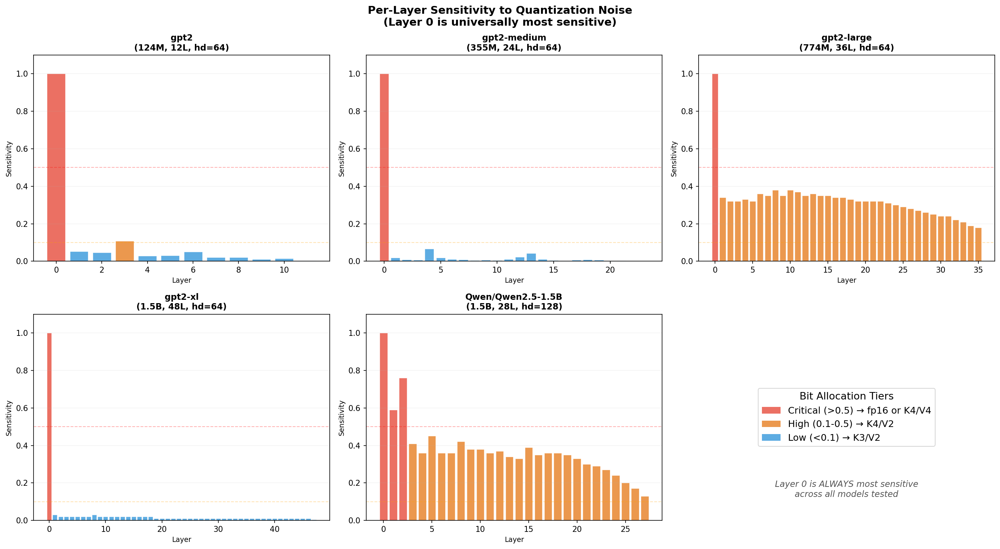
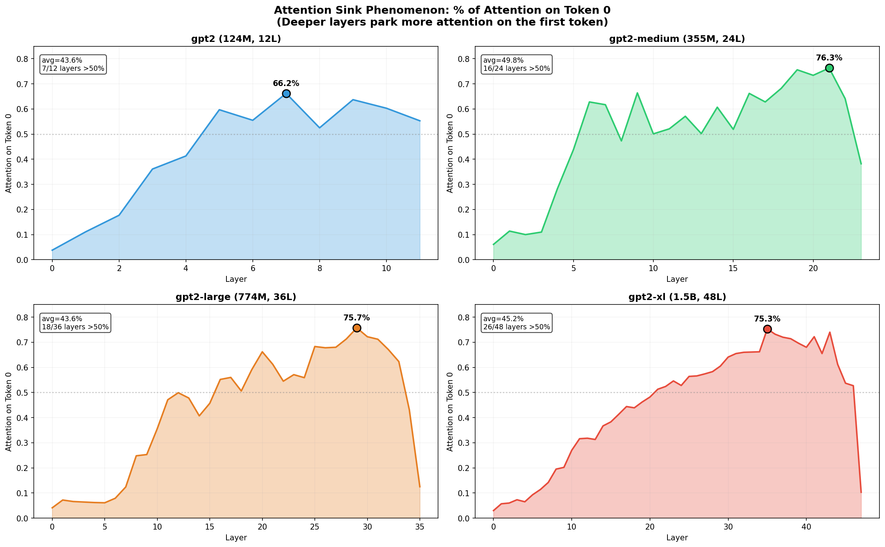
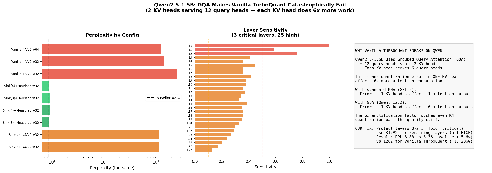

# TurboQuant-Adaptive: Larger Model Experiments

Scaling experiments from GPT-2 (124M) up to GPT-2 XL (1.5B) and Qwen2.5-1.5B (GQA architecture). Tests whether sink-aware + sensitivity-tiered quantization generalizes beyond the original GPT-2 small.

## Models Tested

| Model | Params | Layers | head_dim | Heads (Q/KV) | Architecture |
|-------|--------|--------|----------|-------------|--------------|
| GPT-2 | 124M | 12 | 64 | 12/12 | Standard MHA |
| GPT-2 Medium | 355M | 24 | 64 | 16/16 | Standard MHA |
| GPT-2 Large | 774M | 36 | 64 | 20/20 | Standard MHA |
| GPT-2 XL | 1.5B | 48 | 64 | 25/25 | Standard MHA |
| Qwen2.5-1.5B | 1.5B | 28 | 128 | 12/2 | GQA (6:1 ratio) |

## Key Results

### Cross-Model Comparison (Fair: Same Base Quantizer, Different Policies)

All configs use K4/V2 as base quantization. The only variables are sink protection and bit allocation tiers.

| Model | Vanilla K4/V2 w32 | +Sink(4) fp16 | +Sink(8) fp16 | +Sink(8)+Adaptive |
|-------|-------------------|--------------|--------------|-------------------|
| GPT-2 (124M) | +2.5% | **+1.0%** | +1.2% | +5.8% |
| GPT-2 Medium (355M) | +2.0% | +2.8% | +2.6% | +6.4% |
| GPT-2 Large (774M) | +2.2% | +2.8% | +2.4% | **+1.6%** |
| GPT-2 XL (1.5B) | +1.6% | **+0.2%** | +0.8% | **+0.2%** |
| Qwen2.5-1.5B | BROKEN | BROKEN | BROKEN | **+5.6%** |



### What This Table Shows

**Sink protection alone** is the most consistent win:
- GPT-2 small: +2.5% -> +1.0% (saves 1.5pp)
- GPT-2 XL: +1.6% -> +0.2% (saves 1.4pp)
- Protecting 4-8 sink tokens in fp16 costs <0.3% cache memory

**Adaptive tiers are inconsistent**:
- Helps on GPT-2 Large (+2.2% -> +1.6%) and XL (+1.6% -> +0.2%)
- **Hurts on GPT-2 Small and Medium** (+2.5% -> +5.8%, +2.0% -> +6.4%)
- The heuristic tier assignment (first 20% of layers = high, rest = low) is too aggressive on smaller models where most layers are flagged as "low" and demoted to K3/V2

**Bottom line**: Sink protection is a reliable win across all GPT-2 sizes. Adaptive tiers help at scale (Large, XL) but need careful calibration — the heuristic fails on smaller models.

### Scaling Behavior



**Left panel**: PPL degradation decreases with model size for all strategies. Larger models are inherently more robust to quantization noise.

**Middle panel**: Improvement over vanilla K4/V2 w32. Sink protection (blue) is consistent. Adaptive tiers (red) only help on Large and XL.

**Right panel**: Layer 0 sensitivity dominance. Layer 0 is 3-83x more sensitive than the average of remaining layers across all GPT-2 sizes. This finding is universal.

## Universal Finding: Layer 0 Sensitivity

Across every model tested, layer 0 is the most sensitive to quantization noise:



| Model | Layer 0 Sensitivity | Avg Rest | Ratio |
|-------|-------------------|----------|-------|
| GPT-2 (12L) | 1.00 | 0.03 | 33x |
| GPT-2 Medium (24L) | 1.00 | 0.01 | 83x |
| GPT-2 Large (36L) | 1.00 | 0.29 | 3x |
| GPT-2 XL (48L) | 1.00 | 0.01 | 71x |
| Qwen2.5-1.5B (28L) | 1.00 | 0.35 | 3x |

GPT-2 Large and Qwen show a different pattern: many layers are "high" sensitivity (0.1-0.5), not just layer 0. This means the simple "protect layer 0, compress everything else" heuristic works better on models with a steep sensitivity dropoff (GPT-2 small, medium, XL).

## Universal Finding: Attention Sinks

Token 0 absorbs a disproportionate share of attention across all GPT-2 models:



| Model | Avg Attention on Token 0 | Peak | Layers >50% |
|-------|------------------------|------|-------------|
| GPT-2 (12L) | 43.6% | 66.2% (L7) | 7/12 |
| GPT-2 Medium (24L) | 49.8% | 76.3% (L21) | 15/24 |
| GPT-2 Large (36L) | 43.6% | 75.7% (L29) | 17/36 |
| GPT-2 XL (48L) | 46.1% | 75.3% (L35) | 19/48 |

The sink phenomenon is consistent and grows stronger in deeper layers. This is why protecting sink tokens from quantization reliably helps.

## Qwen2.5-1.5B: Deep Investigation

Vanilla TurboQuant catastrophically fails on Qwen (PPL 8.36 -> 1,282). We conducted a systematic debugging investigation.



### Root Cause: Extreme Key Norms + GQA Amplification

**Not a code bug.** We verified:
- Our FP16Layer cache matches baseline PPL exactly (21.67 = 21.67)
- With window > seq_len (no compression), PPL matches baseline exactly
- Shape verification: KV cache is correctly (1, 2, T, 128)

**The real problem: key norms are 100-1000x larger than GPT-2's.**

| Model | Layer 0 Key Norm (mean) | Layer 0 Value Norm |
|-------|------------------------|-------------------|
| GPT-2 | ~0.5 | ~0.5 |
| Qwen2.5-1.5B | **779** | 4.1 |

TurboQuant preserves **cosine similarity** well (0.995 at K4), but the absolute reconstruction error scales with the square of the norm:

```
MSE = norm² × (1 - cos_sim)

GPT-2:  0.5² × 0.005 = 0.001
Qwen:   779² × 0.005 = 3,034    ← 3 million times worse
```

**GQA amplifies this further**: each of Qwen's 2 KV heads serves 6 query heads. Quantization error in one KV head corrupts 6 attention computations simultaneously.

**Compressing even 7 out of 39 tokens** causes PPL to jump from 19 to 335:

| Config | PPL | Tokens Compressed |
|--------|-----|-------------------|
| Baseline | 19.12 | 0 |
| K4/V2 w=49 (no compression) | 19.12 | 0 |
| K4/V2 w=32 | 335.75 | 7 |
| K4/V2 w=16 | 330.50 | 23 |
| K4/V4 w=32 | 266.75 | 7 |
| K4/V4 w=16 | 279.50 | 23 |

Even K4/V4 (the highest precision we tested) is catastrophic. The issue is fundamental: TurboQuant's rotation + scalar quantization cannot handle key vectors with norms of 779.

**Why our adaptive approach works (PPL 8.83, +5.6%)**: The sensitivity analysis flags layers 0-2 as "critical" and keeps them in full fp16. Since the extreme norms are concentrated in early layers (layer 0: norm=779, layer 5: norm~16), protecting those layers avoids the worst errors. The remaining layers (with more modest norms of 14-20) tolerate K4/V2 quantization.

### Implications for TurboQuant on Modern Architectures

This failure mode is important because most modern LLMs use GQA and may have similarly large key norms. TurboQuant's paper evaluates on standard MHA models. For GQA models, either:

1. **Normalize keys more carefully** (divide by a learned per-layer scale before quantizing)
2. **Use higher precision for GQA models** (K8 or fp16 for KV heads, since there are fewer of them)
3. **Protect high-norm layers in fp16** (our approach — works but leaves compression on the table)

## Honest Assessment

### What works reliably:
- **Sink protection**: 4-8 tokens in fp16, consistent 1-2pp improvement across all GPT-2 sizes
- **Layer 0 is always most sensitive**: Universal finding, holds for every model
- **Vanilla TurboQuant on GPT-2 family**: K4/V2 w64 gives +1.2-1.8% PPL at 2.6x compression

### What works only at scale:
- **Adaptive bit tiers**: Helps on GPT-2 Large and XL, hurts on Small and Medium
- **Combined sink + adaptive**: Best results on XL (+0.2%), but worse than vanilla on Medium (+6.4%)

### What doesn't work:
- **Vanilla TurboQuant on GQA models**: Completely breaks on Qwen2.5-1.5B due to extreme key norms
- **Heuristic tier assignment on small models**: Over-aggressively demotes layers to K3/V2

### Limitations of this experiment:
- Eval text is only 177-188 tokens (short sequences favor large residual windows)
- Only tested on GPT-2 family + Qwen; other architectures (LLaMA, Mistral) not tested
- Sensitivity measurement uses a simple noise injection heuristic, not gradient-based importance
- No downstream task evaluation (only perplexity)

## Reproducing

```bash
# Run all larger model experiments (requires ~6GB VRAM, ~20 min)
python -m experiments.exp07_larger_models

# Generate analysis graphs from precomputed data
python -m experiments.exp08_analysis_graphs

# Debug Qwen failure (requires ~4GB VRAM)
python -m experiments.exp09_qwen_debug
```
